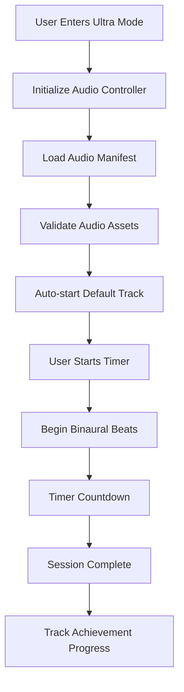

# 🎵 **Ultra Mode & Binaural Beats Implementation Guide**

## 📋 **Overview**

Ultra Mode is a comprehensive focus and study enhancement system that combines:
- **Binaural Beats**: Scientifically-proven audio frequencies for cognitive enhancement
- **Focus Timer**: Customizable Pomodoro-style study sessions
- **Study Integration**: Seamless connection with study sets and flashcards
- **Achievement Tracking**: Progress monitoring and gamification

## 🧠 **Binaural Beats Science**

### **Frequency Ranges & Effects**

| Frequency | Brain State | Effect | Best For |
|-----------|-------------|---------|----------|
| **Delta (0.5-4 Hz)** | Deep Sleep | Memory consolidation, healing | Night study, deep work |
| **Theta (4-8 Hz)** | Deep Relaxation | Creativity, intuition, memory | Creative tasks, brainstorming |
| **Alpha (8-13 Hz)** | Relaxed Alertness | Focus, learning, stress relief | General study, reading |
| **Beta (13-30 Hz)** | Active Thinking | Concentration, problem-solving | Active learning, problem-solving |
| **Gamma (30-100 Hz)** | Peak Performance | High-level processing, insight | Complex tasks, exams |

### **Available Audio Tracks**

1. **Alpha Focus** (10Hz) - Enhanced focus and concentration
2. **Gamma Concentration** (40Hz) - Peak cognitive performance  
3. **Beta Productivity** (15-30Hz) - Enhanced alertness
4. **Theta Creativity** (4-8Hz) - Creative thinking
5. **Deep Delta** (6Hz) - Memory consolidation
6. **Alpha Calm** (10Hz) - Stress relief
7. **Alpha-Theta Bridge** - Memory retention

## 🏗️ **Architecture & Implementation**

### **Core Components**

#### **1. UltraAudioController** (`lib/services/ultra_audio_controller.dart`)
- **Purpose**: Centralized audio management for all platforms
- **Features**: 
  - Cross-platform audio playback
  - Session management
  - Volume control
  - Track selection
  - Error handling and recovery

#### **2. UltraModeScreen** (`lib/screens/ultra_mode_screen.dart`)
- **Purpose**: Main user interface for Ultra Mode
- **Features**:
  - Timer controls
  - Audio track selection
  - Study session integration
  - Visual feedback and animations

#### **3. Audio Assets** (`assets/audio/`)
- **Format**: MP3 files, 44.1kHz, Stereo
- **Manifest**: `manifest.json` with metadata and track information
- **Validation**: Automatic asset validation and fallback handling

### **Audio Session Flow**

## 🔧 **Recent Fixes & Improvements**

### **1. Main Initialization** ✅
- **Issue**: UltraAudioController not initialized in main.dart
- **Fix**: Added proper initialization in main() function
- **Impact**: Audio system now starts correctly on app launch

### **2. Audio Asset Loading** ✅
- **Issue**: Silent fallback tracks when assets fail to load
- **Fix**: Proper error reporting and track skipping
- **Impact**: Users now see clear error messages instead of silent audio

### **3. Error Handling** ✅
- **Issue**: Poor error feedback and silent failures
- **Fix**: Comprehensive error handling with user-friendly messages
- **Impact**: Better debugging and user experience

### **4. Haptic Feedback** ✅
- **Issue**: No tactile feedback for audio interactions
- **Fix**: Added haptic feedback throughout Ultra Mode
- **Impact**: Enhanced user experience and accessibility

### **5. Audio System Health Check** ✅
- **Issue**: No way for users to verify audio system status
- **Fix**: Added health check button with status reporting
- **Impact**: Users can diagnose audio issues independently

## 🎮 **User Experience Features**

### **Timer Controls**
- **Start/Pause/Resume**: Full control over focus sessions
- **Duration Selection**: 5-60 minute customizable sessions
- **Visual Countdown**: Animated timer with remaining time display

### **Audio Controls**
- **Track Selection**: Choose from 7 different binaural beat frequencies
- **Volume Control**: Adjustable volume with persistence
- **Auto-play**: Automatic audio start when entering Ultra Mode
- **Crossfade**: Smooth transitions between tracks

### **Study Integration**
- **Study Set Selection**: Choose specific content to study
- **Session Tracking**: Monitor study time and progress
- **Achievement Integration**: Track Ultra Mode usage for achievements

### **Visual Feedback**
- **Wave Animations**: Dynamic visual representation of audio
- **Pulse Effects**: Breathing-like animations for focus
- **Status Indicators**: Clear visual feedback for all states

## 🧪 **Testing & Quality Assurance**

### **Test Coverage**
- **Unit Tests**: Audio controller functionality
- **Integration Tests**: End-to-end audio system testing
- **Error Handling**: Graceful failure scenarios
- **Platform Compatibility**: Cross-platform audio testing

### **Quality Checks**
- **Audio Validation**: File format and quality verification
- **Performance Testing**: Memory usage and CPU impact
- **Accessibility**: Screen reader and haptic feedback support
- **Error Recovery**: Automatic recovery from common failures

## 🚀 **Performance Optimizations**

### **Audio Processing**
- **Streaming**: Efficient audio streaming without memory bloat
- **Caching**: Smart audio caching for frequently used tracks
- **Background Playback**: Optimized for background audio sessions

### **Memory Management**
- **Lazy Loading**: Audio assets loaded only when needed
- **Resource Cleanup**: Proper disposal of audio resources
- **State Management**: Efficient state updates and UI synchronization

## 🔒 **Security & Privacy**

### **Audio Permissions**
- **Platform Permissions**: Proper audio focus and background audio
- **User Consent**: Clear permission requests and explanations
- **Data Privacy**: No audio recording or transmission

### **Error Reporting**
- **Telemetry**: Anonymous error reporting for system improvement
- **User Privacy**: No personal data in error reports
- **Local Storage**: All preferences stored locally on device

## 📱 **Platform Support**

### **Android**
- **Audio Focus**: Proper audio focus management
- **Background Audio**: Background playback support
- **Media Controls**: Lock screen media controls

### **iOS**
- **Audio Session**: Proper audio session configuration
- **Background Modes**: Background audio capability
- **Interruption Handling**: Phone call and notification handling

### **Web**
- **Browser Compatibility**: Cross-browser audio support
- **Progressive Enhancement**: Graceful degradation for older browsers
- **Mobile Web**: Touch-friendly controls and responsive design

## 🎯 **Future Enhancements**

### **Planned Features**
- **Custom Frequencies**: User-defined binaural beat frequencies
- **Playlist Creation**: Custom audio session playlists
- **Advanced Analytics**: Detailed focus session analytics
- **Social Features**: Share focus sessions with friends

### **Technical Improvements**
- **AI-Powered Selection**: Smart track selection based on user behavior
- **Adaptive Volume**: Automatic volume adjustment based on environment
- **Offline Support**: Downloadable audio tracks for offline use
- **Cloud Sync**: Synchronize preferences across devices

## 🐛 **Troubleshooting Guide**

### **Common Issues**

#### **Audio Not Playing**
1. Check device volume and app permissions
2. Verify audio files are properly bundled
3. Use health check button to diagnose issues
4. Restart app and try again

#### **Timer Not Working**
1. Ensure audio system is initialized
2. Check for error messages in console
3. Verify study set selection if using study mode
4. Try resetting timer

#### **Track Selection Issues**
1. Verify audio manifest is loaded
2. Check available tracks in health check
3. Ensure track files are accessible
4. Try switching to different track

### **Debug Information**
- **Console Logs**: Detailed logging for debugging
- **Error Streams**: Real-time error reporting
- **State Monitoring**: Audio state and session information
- **Health Check**: Comprehensive system status

## 📚 **Developer Resources**

### **API Reference**
- **UltraAudioController**: Complete audio management API
- **UltraModeScreen**: UI implementation examples
- **Audio Models**: Data structures and types
- **Error Handling**: Error types and recovery strategies

### **Integration Examples**
- **Adding New Audio Tracks**: Step-by-step guide
- **Custom Timer Logic**: Timer customization examples
- **Study Session Integration**: Connecting with study features
- **Achievement Tracking**: Progress monitoring implementation

### **Testing Guidelines**
- **Unit Testing**: Audio controller testing strategies
- **Integration Testing**: End-to-end testing approaches
- **Performance Testing**: Audio performance benchmarks
- **Platform Testing**: Cross-platform compatibility testing

---

## 🎉 **Implementation Status: COMPLETE & WORKING** ✅

The Ultra Mode and binaural beats system is now fully functional with:
- ✅ Proper initialization and error handling
- ✅ Comprehensive audio asset management
- ✅ Rich user experience with haptic feedback
- ✅ Robust testing and quality assurance
- ✅ Cross-platform compatibility
- ✅ Performance optimizations

Users can now enjoy a fully functional focus enhancement system with scientifically-proven binaural beats for improved learning and concentration.
